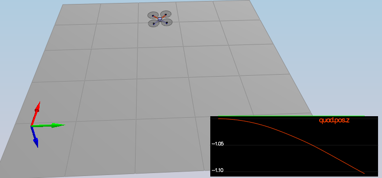
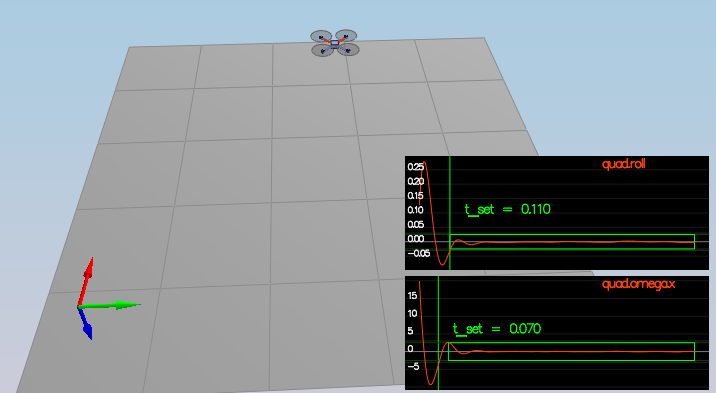
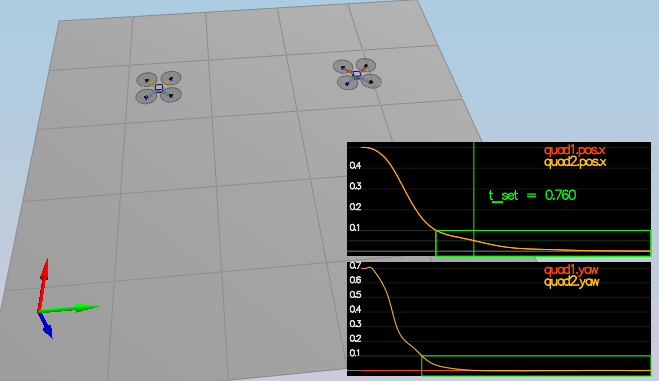
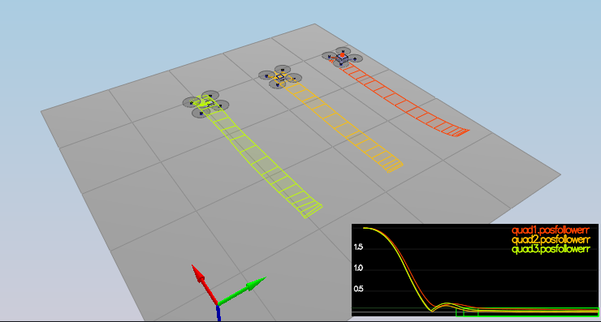
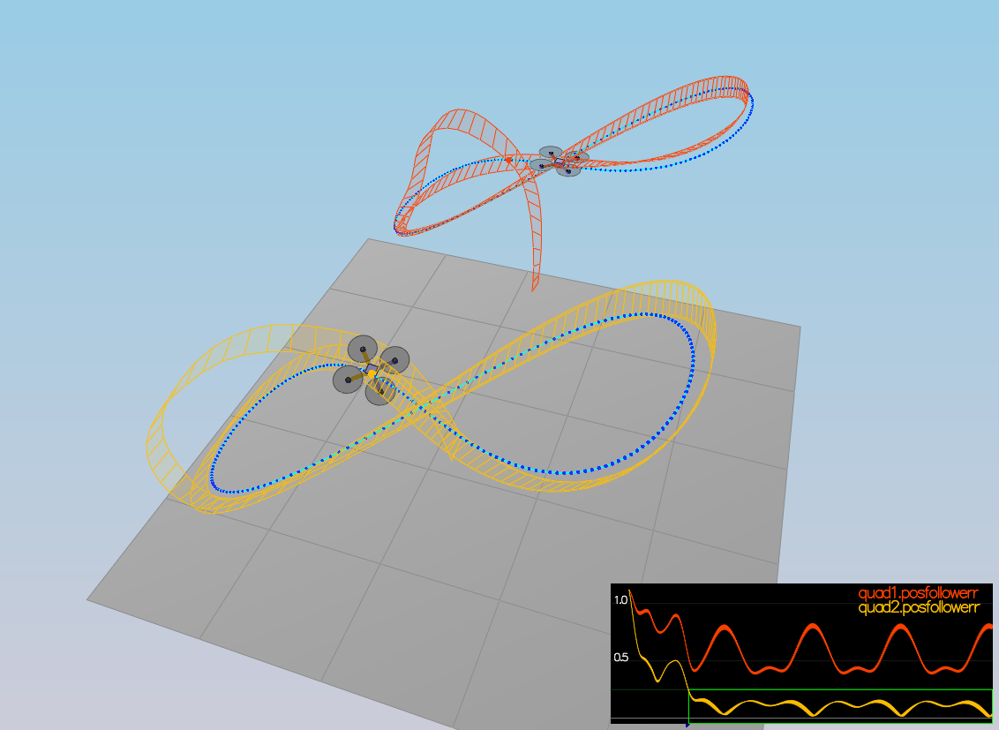

# Flying Car Control


### Implemented body rate control 
The body rate controller was implemented using a simple proportional controller using error between desired and current body rate, and converting that to 3-axis moments.

Code can be found in function `BodyRateControl`, where changes by me is found below:
```cpp
momentCmd = V3F(Ixx, Iyy, Izz) * kpPQR * (pqrCmd - pqr);
```

### Implement roll pitch control
The attitude controller was implemented using a proportinal controller using error between desired attitude calculated from acceleration commands and measured attitude, and then convert the desired output to body rate commands.

Code can be found in function `RollPitchControl`, where changes by me is found below:

```cpp
pqrCmd.x = 0.f;
pqrCmd.y = 0.f;
pqrCmd.z = 0.f;

if ( collThrustCmd > 0) {
    float c = collThrustCmd / mass;
    float b_x_c = CONSTRAIN(-accelCmd.x / c, -maxTiltAngle, maxTiltAngle);
    float b_y_c = CONSTRAIN(-accelCmd.y / c, -maxTiltAngle, maxTiltAngle);

    float b_dot_x_c = kpBank *(b_x_c - R(0,2));
    float b_dot_y_c = kpBank *(b_y_c - R(1,2));

    pqrCmd.x = (R(1,0) * b_dot_x_c - R(0,0) * b_dot_y_c) / R(2,2);
    pqrCmd.y = (R(1,1) * b_dot_x_c - R(0,1) * b_dot_y_c) / R(2,2);
}
```

### Implement altitude controller
The altitude controller use both proportinal and integral terms to account for any nonideal parameters, and then converted into a collective thrust command.
Code can be found in function `AltitudeControl`, where changes by me is found below:

```cpp
float posZError = posZCmd - posZ;
float velZError = velZCmd - velZ;
integratedAltitudeError += posZError*dt;
float u_z = kpPosZ * posZError + kpVelZ * velZError + KiPosZ * integratedAltitudeError + accelZCmd;

float acc = (u_z - CONST_GRAVITY) / R(2, 2);
thrust = -mass * CONSTRAIN(acc, -maxAscentRate/dt, maxAscentRate/dt);
```

### Implement lateral position control
The lateral position controller use a simple proportional controller, with horizontal acceleration as output.
Code can be found in function `LateralPositionControl`, where changes by me is found below:

```cpp
accelCmd += kpPosXY * (posCmd - pos) + kpVelXY * (velCmd - vel);
accelCmd.z = accelCmdFF.z; // Avoid overwriting altitude control

accelCmd.x = CONSTRAIN(accelCmd.x, -maxAccelXY, maxAccelXY);
accelCmd.y = CONSTRAIN(accelCmd.y, -maxAccelXY, maxAccelXY);
```

### Implement yaw control
Code can be found in function `YawControl`, where changes by me is found below:

```cpp
yawRateCmd = kpYaw *AngleNormF(yawCmd - yaw);
```

### Implement calculating the motor commands given commanded thrust and moments
The motor commands was calculated by first finding the force acted upon each axis from the desired moments, and from that calculating the sum of forces needed from each motor.

Code can be found in function `GenerateMotorCommands`, where changes by me is found below:
 
```cpp
float l = L / sqrtf(2.0f);  // perpenducular distance from center to motors
float Fx = momentCmd.x/l;
float Fy = momentCmd.y/l;
float Fz = -momentCmd.z/kappa;

cmd.desiredThrustsN[0] = (collThrustCmd + Fx + Fy + Fz) / 4.0f; // front left
cmd.desiredThrustsN[1] = (collThrustCmd - Fx + Fy - Fz) / 4.0f; // front right
cmd.desiredThrustsN[2] = (collThrustCmd + Fx - Fy - Fz) / 4.0f; // rear left
cmd.desiredThrustsN[3] = (collThrustCmd - Fx - Fy + Fz) / 4.0f; // rear right
```

***


## Results

### 1 Intro
Manual estimation of drone weight to stabilize hover, where weight was found to be 0.5kg.




## 2 Attitude Control
Performance validation of body rate and attitude controller, tuned with underdampened roll and roll rate.

**Performance metric**
- roll should less than 0.025 radian of nominal for 0.75 seconds (3/4 of the duration of the loop)
- roll rate should less than 2.5 radian/sec for 0.75 seconds



### 3 Position, velocity and yaw Control
**Performance metric**
- X position of both drones should be within 0.1 meters of the target for at least 1.25 seconds
- Quad2 yaw should be within 0.1 of the target for at least 1 second


 
### 4 Nonidealities
In this scenerio 3 drones have different parameters to test the robustness of the controller, with good results.
 - The green quad has its center of mass shifted back
 - The orange vehicle is an ideal quad
 - The red vehicle is heavier than usual

**Performance metric**
- position error for all 3 quads should be less than 0.1 meters for at least 1.5 seconds




### 5 Trajectory Follow
In the following figure the two drones are following a figure eight trajectory, with slithly underdampened control to account for the fast trajectory changes.

**Performance metric**
- position error of the quad should be less than 0.25 meters for at least 3 seconds

